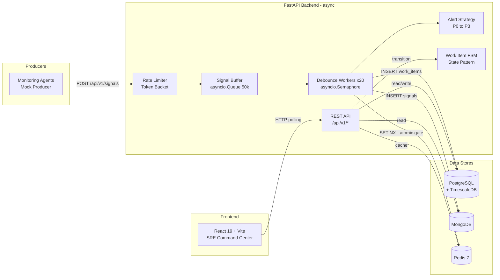
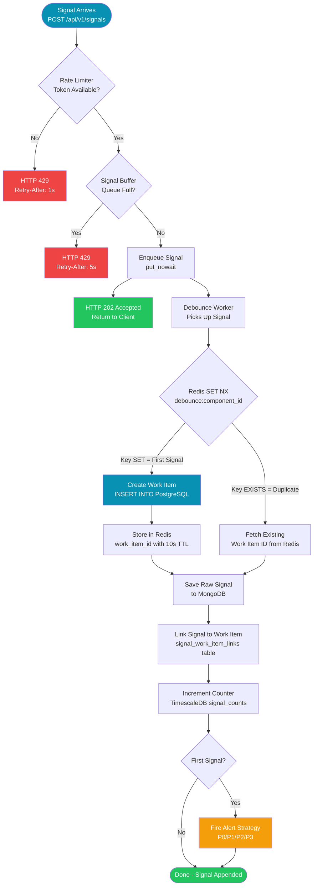
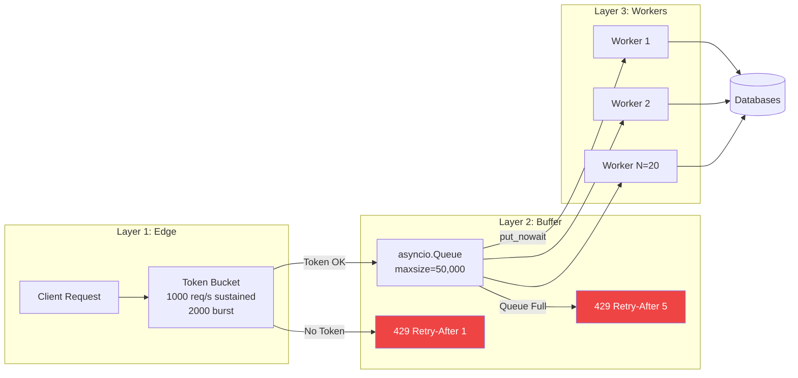
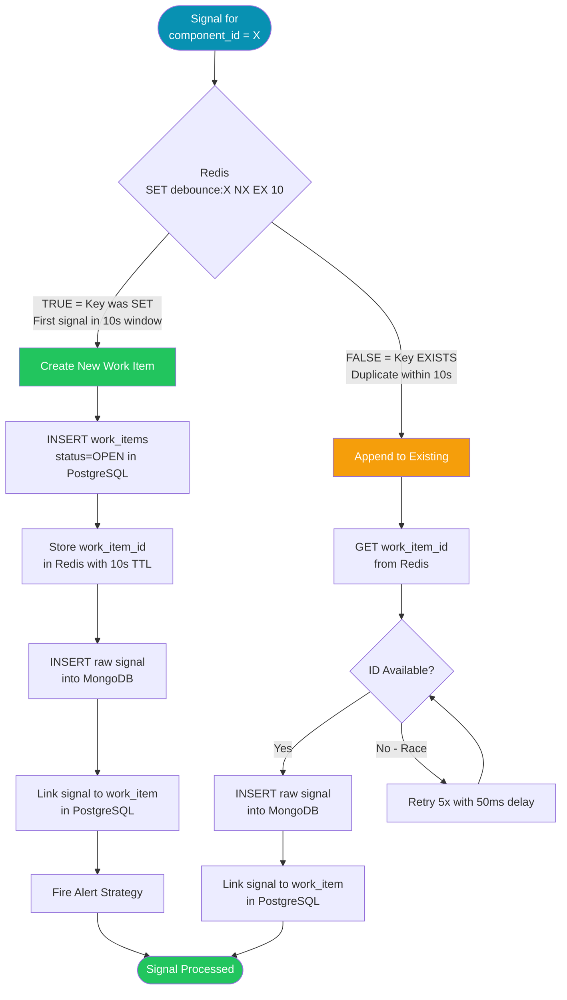
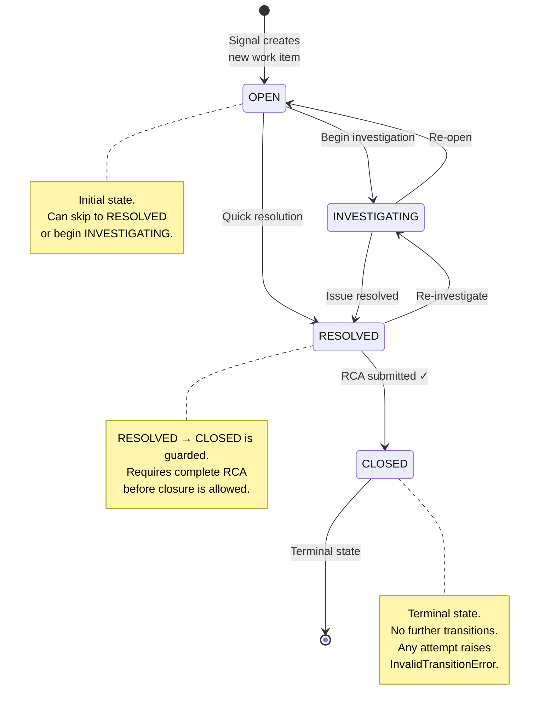
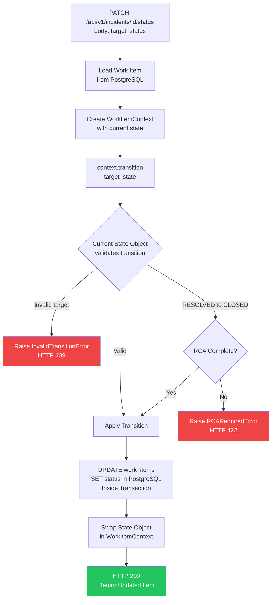
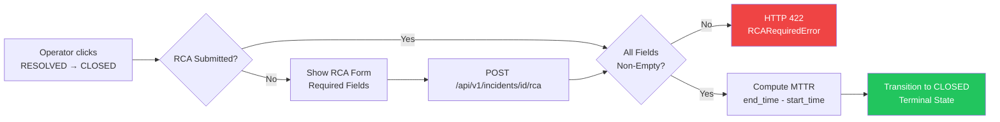
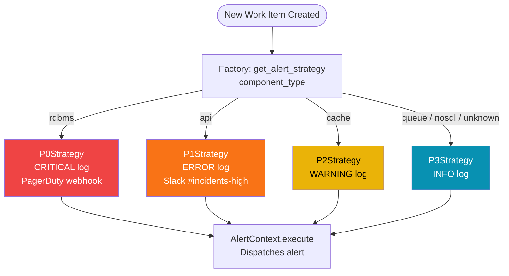
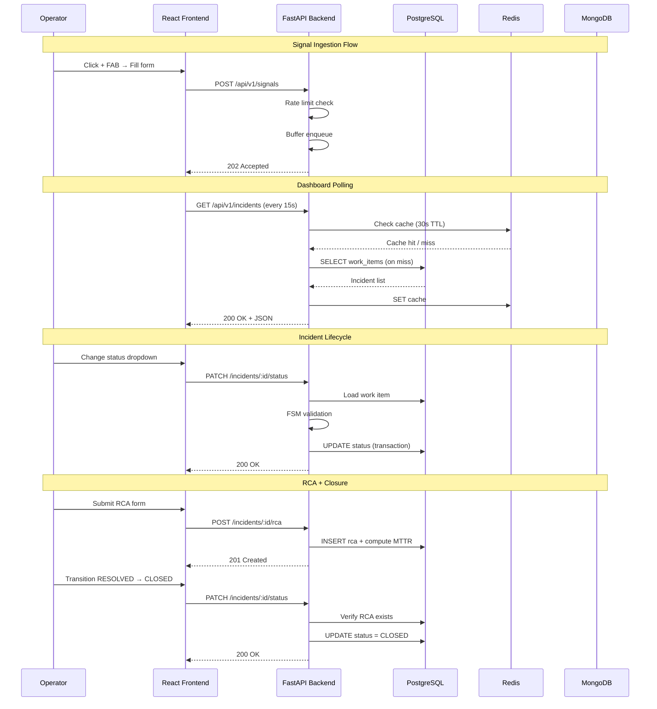
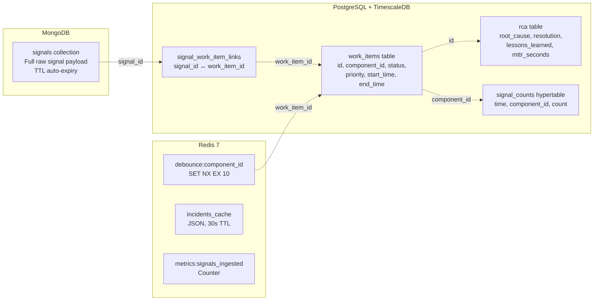

# Incident Management System

A real-time, event-driven incident management platform that ingests raw infrastructure signals, deduplicates them via a debounce engine, creates actionable work items, enforces a strict lifecycle FSM, and provides a live SRE Command Center dashboard.

---

## Table of Contents

1. [System Overview](#system-overview)
2. [End-to-End Flow](#end-to-end-flow)
3. [Signal Ingestion Pipeline](#signal-ingestion-pipeline)
4. [Debounce Engine](#debounce-engine)
5. [Work Item Lifecycle (FSM)](#work-item-lifecycle-fsm)
6. [Alert Strategy Pattern](#alert-strategy-pattern)
7. [Frontend Architecture](#frontend-architecture)
8. [Data Flow Between Stores](#data-flow-between-stores)
9. [Backpressure & Load Shedding](#backpressure--load-shedding)
10. [Tech Stack](#tech-stack)
11. [API Reference](#api-reference)
12. [How to Run](#how-to-run)
13. [Test Suite](#test-suite)
14. [Project Structure](#project-structure)

---

## System Overview



The system consists of four main layers:

| Layer | Role |
|-------|------|
| **Producers** | External monitoring agents or the mock producer send raw signals via HTTP |
| **Backend** | FastAPI processes signals through rate limiter → buffer → debounce workers |
| **Data Stores** | PostgreSQL (work items), MongoDB (raw signals), Redis (cache + debounce) |
| **Frontend** | React SRE Command Center with live polling and incident management UI |

---

## End-to-End Flow

This is the complete journey of a signal from ingestion to resolution:



**Key insight**: The client gets `202 Accepted` immediately. All heavy work (DB writes, deduplication, alerting) happens asynchronously in the worker pool.

---

## Signal Ingestion Pipeline

The ingestion pipeline uses three layers of defence to prevent cascading failures:



### How it works step by step:

1. **Token Bucket Rate Limiter** (`rate_limiter.py`)
   - Maintains a token bucket with `rate=1000` tokens/sec and `capacity=2000`
   - Each request consumes one token via `acquire()`
   - If empty → HTTP 429 with `Retry-After: 1` header
   - Uses `asyncio.Lock` for safe concurrent access

2. **Bounded Signal Buffer** (`buffer.py`)
   - `asyncio.Queue` with `maxsize=50,000`
   - Producer side: `put_nowait()` — never blocks the event loop
   - If full → `QueueFull` exception → HTTP 429 with `Retry-After: 5`
   - Consumer side: `await get()` — workers block until signal available

3. **Debounce Worker Pool** (`debounce.py`)
   - 20 concurrent workers controlled by `asyncio.Semaphore`
   - Each worker loops: `get()` → `process()` → `task_done()`
   - Workers are spawned as `asyncio.Task` during FastAPI lifespan startup
   - Cancelled gracefully on shutdown

---

## Debounce Engine

The debounce engine prevents duplicate work items when the same component sends many signals in a short window:



### Redis SET NX — The Atomic Gate

```
SET debounce:{component_id} "" NX EX 10
```

- **NX** = Only set if key does Not eXist (atomic check-and-set)
- **EX 10** = Key expires after 10 seconds (debounce window)
- This single Redis command is the **serialisation point** — no two workers can both create a work item for the same component within the window

### Race Condition Handling

There's a tiny window where Worker A sets the key but hasn't written the work item ID yet, while Worker B sees the key exists but can't find the ID. Solution: Worker B retries up to 5 times with 50ms delays.

---

## Work Item Lifecycle (FSM)

Work items follow a strict Finite State Machine enforced by the **State Pattern**:



### Transition Rules

| From | Valid Targets | Guard |
|------|-------------|-------|
| **OPEN** | INVESTIGATING, RESOLVED | None |
| **INVESTIGATING** | RESOLVED, OPEN | None |
| **RESOLVED** | CLOSED, INVESTIGATING | CLOSED requires RCA ✓ |
| **CLOSED** | *(none — terminal)* | Raises `InvalidTransitionError` |

### How Transitions Work (Code Flow)



### RCA Closure Guard

Before closing an incident, the system verifies the RCA (Root Cause Analysis) is complete:



RCA fields: `root_cause`, `resolution`, `lessons_learned`, `detection_time`, `resolution_time`

---

## Alert Strategy Pattern

The system uses the **Strategy Pattern** to decouple alerting logic from the ingestion pipeline:



| Component Type | Priority | Strategy | Channel |
|---------------|----------|----------|---------|
| `rdbms` | P0 | `P0Strategy` | CRITICAL log + PagerDuty |
| `api` | P1 | `P1Strategy` | ERROR log + Slack |
| `cache` | P2 | `P2Strategy` | WARNING log |
| `queue`, `nosql`, `unknown` | P3 | `P3Strategy` | INFO log |

**Why Strategy Pattern?** Adding a new priority level (e.g., P4 for cosmetic issues) requires creating one new class and adding one entry to the factory map — zero changes to the ingestion pipeline.

---

## Frontend Architecture

The React frontend is an SRE Command Center with 11 pages and 5 modal components:

```mermaid
flowchart TD
    subgraph "App Shell - Layout.jsx"
        HEADER[Top Navigation Bar<br/>System Map / Live Metrics / Log Stream / Alerts]
        SIDEBAR[Side Navigation<br/>Dashboard / Incidents / Nodes / Security / Terminal]
        FAB[FAB + Button<br/>Create Incident]
    end

    subgraph "Pages via React Router"
        DASH[/ Dashboard<br/>Stats + Health + Recent]
        INC[/incidents<br/>Incident Feed + Filters]
        DET[/incidents/:id<br/>Detail + FSM Controls + RCA]
        NOD[/nodes<br/>Infrastructure Nodes]
        SEC[/security<br/>Threat Assessment]
        TER[/terminal<br/>Interactive CLI]
        SYS[/system-map<br/>Network Topology]
        MET[/live-metrics<br/>CPU/Mem/Disk Gauges]
        LOG[/log-stream<br/>Real-time Log Viewer]
        SET[/settings<br/>Preferences]
        HLP[/help<br/>Docs + API Ref]
    end

    subgraph "Modals"
        M1[CreateIncidentModal<br/>POST /api/v1/signals]
        M2[CommandPalette<br/>Ctrl+K Search]
        M3[NotificationsPanel<br/>Recent Alerts]
        M4[DeployPatchModal<br/>Health Check + Deploy]
        M5[FilterPanel<br/>Status + Priority]
    end

    HEADER --> SYS
    HEADER --> MET
    HEADER --> LOG
    SIDEBAR --> DASH
    SIDEBAR --> INC
    SIDEBAR --> NOD
    SIDEBAR --> SEC
    SIDEBAR --> TER
    FAB --> M1
```

### Frontend-to-Backend Data Flow



---

## Data Flow Between Stores

Each database serves a specific purpose — no single store does everything:



| Store | Data | Why This Store |
|-------|------|---------------|
| **PostgreSQL** | Work items, RCA, links, counters | ACID transactions, row-level locking, relational joins |
| **TimescaleDB** | `signal_counts` hypertable | Time-series aggregation on top of PostgreSQL |
| **MongoDB** | Raw signal payloads | Flexible schema, high write throughput, TTL auto-expiry |
| **Redis** | Debounce keys, cache, metrics | Sub-millisecond reads, atomic SET NX, ephemeral data |

---

## Backpressure & Load Shedding

```
Client → Rate Limiter → Buffer (50k) → Debounce Workers (×20) → DBs
            │ 429           │ 429
            ▼               ▼
        (bucket empty)  (queue full)
```

**Two layers of defence:**

1. **Token-bucket rate limiter** — caps sustained throughput at 1,000 req/s with burst to 2,000. Returns HTTP 429 + `Retry-After` before the request even reaches the buffer.
2. **Bounded buffer** — if the 20 debounce workers can't keep up (DB slowness), the queue fills. `put_nowait()` raises `QueueFull`, and the endpoint returns HTTP 429 + `Retry-After: 5`.

**Why this prevents cascading failures:** The system never allocates unbounded memory, never blocks the event loop, and never crashes under load. Excess traffic is shed at the edge, giving downstream databases time to recover.

> **Why not Kafka?** At this scale, an in-process `asyncio.Queue` gives bounded backpressure with zero operational overhead. If the system later needs cross-process durability or multi-consumer fan-out, swapping in Kafka is a single-layer change.

---

## Tech Stack

| Component | Technology | Rationale |
|-----------|-----------|-----------| 
| Backend runtime | Python 3.12 + FastAPI + asyncio | Native async, great for high-throughput I/O |
| RDBMS (work items, RCA) | PostgreSQL 16 | ACID transactions, row-level locking |
| Time-series aggregation | TimescaleDB (PG extension) | Reuses PG connection pool, hypertable for signal counts |
| NoSQL (raw signals) | MongoDB | Flexible schema, high write throughput, TTL auto-expiry |
| Cache & Pub/Sub | Redis 7 | Sub-millisecond reads, debounce keys, dashboard cache |
| Message passing | `asyncio.Queue` (bounded, in-process) | No Kafka overhead at this scale; documented trade-off |
| Frontend | React 19 + Vite + Tailwind CSS | Fast HMR, utility-first CSS, modern component model |
| Container orchestration | Docker Compose v2 | Single-command local development |

---

## API Reference

| Method | Endpoint | Description | Response |
|--------|----------|-------------|----------|
| `POST` | `/api/v1/signals` | Ingest a raw signal (rate-limited) | `202 Accepted` |
| `GET` | `/api/v1/incidents` | List active incidents (Redis-cached, 30s TTL) | `200 OK` |
| `GET` | `/api/v1/incidents/{id}` | Incident detail + linked raw signals | `200 OK` |
| `PATCH` | `/api/v1/incidents/{id}/status` | FSM state transition | `200 OK` / `409` / `422` |
| `POST` | `/api/v1/incidents/{id}/rca` | Submit RCA + compute MTTR | `201 Created` |
| `GET` | `/health` | Parallel health check (PG, Redis, Mongo) | `200` / `503` |

---

## How to Run

### Prerequisites

- **Docker Desktop** (with Docker Compose v2)
- **Git**

### 1. Clone and start

```bash
git clone <repo-url> && cd ims
docker compose up --build
```

This starts five services with health-checked dependencies:

| Service | Port | Description |
|---------|------|-------------|
| PostgreSQL + TimescaleDB | 5432 | Relational + time-series store |
| MongoDB | 27017 | Raw signal audit log |
| Redis | 6379 | Cache, debounce keys, metrics |
| Backend (FastAPI) | 8000 | REST API + debounce workers |
| Frontend (Vite) | 5173 | SRE Command Center dashboard |

### 2. Seed sample data

```bash
pip install httpx
python scripts/simulate_failure.py
```

This sends 200 signals across 2 components, creating exactly 2 work items.

### 3. Access the application

| URL | Description |
|-----|-------------|
| http://localhost:5173 | SRE Command Center |
| http://localhost:8000/docs | Swagger UI (auto-generated) |
| http://localhost:8000/health | Health check |

---

## Test Suite

Run all 24 tests (no infrastructure required):

```bash
python -m pytest backend/tests/ -v
```

| File | Tests | Covers |
|------|-------|--------|
| `test_rca_validation.py` | 12 | Pydantic model validation, RCA guard, MTTR calculation |
| `test_state_machine.py` | 12 | All valid/invalid FSM transitions, terminal state, RCA guard |
| `test_debounce.py` | 3 | First signal creates WI, duplicate appends, post-TTL creates new |

---

## Project Structure

```
ims/
├── backend/
│   ├── main.py                  # FastAPI app factory + lifespan
│   ├── config.py                # pydantic-settings (env vars)
│   ├── api/routes/
│   │   ├── signals.py           # POST /api/v1/signals
│   │   ├── incidents.py         # CRUD + FSM + RCA
│   │   └── health.py            # GET /health
│   ├── core/
│   │   ├── buffer.py            # Bounded asyncio.Queue (50k)
│   │   ├── debounce.py          # Debounce engine (20 workers)
│   │   └── rate_limiter.py      # Token bucket
│   ├── patterns/
│   │   ├── alert_strategy.py    # Strategy pattern (P0–P3)
│   │   └── work_item_state.py   # State pattern / FSM
│   ├── db/
│   │   ├── postgres.py          # asyncpg pool + retry
│   │   ├── mongo.py             # motor client + retry
│   │   ├── redis_client.py      # aioredis
│   │   ├── retry.py             # async_retry decorator
│   │   ├── mongo_setup.py       # MongoDB indexes
│   │   └── migrations/
│   │       ├── 001_initial.sql  # PG schema
│   │       └── 002_timeseries.sql # TimescaleDB hypertable
│   ├── models/                  # Pydantic models
│   ├── services/                # Business logic
│   └── tests/                   # pytest + pytest-asyncio
├── frontend/
│   └── src/
│       ├── components/          # Layout, Modals, Feed, Detail
│       ├── pages/               # 11 page components
│       ├── api.js               # Axios instance
│       ├── main.jsx             # React Router entry
│       └── index.css            # Design system tokens
├── scripts/
│   └── simulate_failure.py      # Sample data generator
├── docs/
│   ├── TECH_STACK.md
│   ├── ARCHITECTURE.md
│   ├── BACKPRESSURE.md
│   └── PROMPTS.md
├── docker-compose.yml
└── README.md
```
