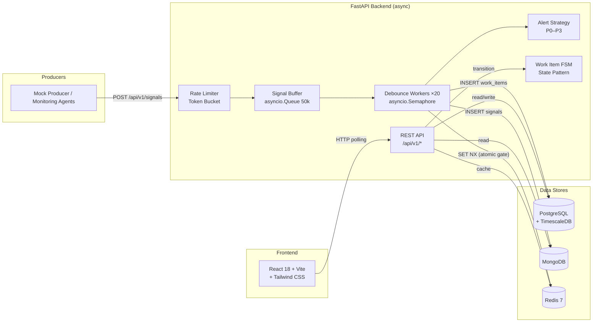

# Incident Management System

A real-time, event-driven incident management platform that ingests raw infrastructure signals, deduplicates them via a debounce engine, creates actionable work items, enforces a strict lifecycle FSM, and provides a live operations dashboard — all built on an async Python backend and a React frontend.

---

## Architecture



---

## Tech Stack

| Component | Technology | Rationale |
|-----------|-----------|-----------|
| Backend runtime | Python 3.12 + FastAPI + asyncio | Native async, great for high-throughput I/O |
| RDBMS (work items, RCA) | PostgreSQL 16 | ACID transactions, row-level locking |
| Time-series aggregation | TimescaleDB (PG extension) | Reuses PG connection pool, hypertable for signal counts |
| NoSQL (raw signals) | MongoDB | Flexible schema, high write throughput, TTL auto-expiry |
| Cache & Pub/Sub | Redis 7 | Sub-millisecond reads, debounce keys, dashboard cache |
| Message passing | `asyncio.Queue` (bounded, in-process) | No Kafka overhead at this scale; documented trade-off |
| Frontend | React 18 + Vite + Tailwind CSS | Fast HMR, utility-first CSS, modern component model |
| Container orchestration | Docker Compose v2 | Single-command local development |

---

## How to Run

### Prerequisites

- **Docker Desktop** (with Docker Compose v2)
- **Git**

### 1. Clone and start

```bash
git clone <repo-url> && cd ims
docker compose up --build
```

This starts six services with health-checked dependencies:

| Service | Port | Description |
|---------|------|-------------|
| PostgreSQL + TimescaleDB | 5432 | Relational + time-series store |
| MongoDB | 27017 | Raw signal audit log |
| Redis | 6379 | Cache, debounce keys, metrics |
| Backend (FastAPI) | 8000 | REST API + debounce workers |
| Frontend (Vite) | 5173 | Operations dashboard |
| Mock Producer | — | (optional) signal generator |

### 2. Seed sample data

```bash
pip install httpx
python scripts/simulate_failure.py
```

This sends 200 signals across 2 components, creating exactly 2 work items.

### 3. Access the application

| URL | Description |
|-----|-------------|
| http://localhost:5173 | Frontend dashboard |
| http://localhost:8000/docs | Swagger UI (auto-generated) |
| http://localhost:8000/health | Health check |

---

## Backpressure & Load Shedding

The ingestion pipeline uses a **bounded in-memory ring buffer** (`asyncio.Queue` with `maxsize=50,000`). Every incoming signal is placed onto this buffer via `put_nowait()`.

```
Client → Rate Limiter → Buffer (50k) → Debounce Workers (×20) → DBs
            │ 429           │ 429
            ▼               ▼
        (bucket empty)  (queue full)
```

**Two layers of defence:**

1. **Token-bucket rate limiter** — caps sustained throughput at 1,000 req/s with burst to 2,000. Returns HTTP 429 + `Retry-After` before the request even reaches the buffer.
2. **Bounded buffer** — if the 20 debounce workers can't keep up (DB slowness), the queue fills. `put_nowait()` raises `QueueFull`, and the endpoint returns HTTP 429 + `Retry-After: 5`.

**Why this prevents cascading failures:** The system never allocates unbounded memory, never blocks the event loop, and never crashes under load. Excess traffic is shed at the edge, giving downstream databases time to recover.

> **Why not Kafka?** At this scale, an in-process `asyncio.Queue` gives bounded backpressure with zero operational overhead. If the system later needs cross-process durability or multi-consumer fan-out, swapping in Kafka is a single-layer change.

---

## API Reference

| Method | Endpoint | Description | Response |
|--------|----------|-------------|----------|
| `POST` | `/api/v1/signals` | Ingest a raw signal (rate-limited) | `202 Accepted` |
| `GET` | `/api/v1/incidents` | List active incidents (Redis-cached, 30s TTL) | `200 OK` |
| `GET` | `/api/v1/incidents/{id}` | Incident detail + linked raw signals | `200 OK` |
| `PATCH` | `/api/v1/incidents/{id}/status` | FSM state transition | `200 OK` / `409` / `422` |
| `POST` | `/api/v1/incidents/{id}/rca` | Submit RCA + compute MTTR | `201 Created` |
| `GET` | `/health` | Parallel health check (PG, Redis, Mongo) | `200` / `503` |

---

## Design Patterns

### Strategy Pattern — Alerting (`backend/patterns/alert_strategy.py`)

An abstract `AlertStrategy` base class with four concrete implementations (P0–P3), selected at runtime by a factory function `get_alert_strategy(component_type)`. The ingestion worker never decides *how* to alert — it calls the factory and delegates. Adding a new priority level is a one-class change.

```
AlertStrategy (ABC)
├── P0Strategy  →  CRITICAL log, PagerDuty webhook
├── P1Strategy  →  ERROR log, Slack #incidents-high
├── P2Strategy  →  WARNING log
└── P3Strategy  →  INFO log
```

### State Pattern — Work Item FSM (`backend/patterns/work_item_state.py`)

Four concrete state classes enforce valid lifecycle transitions. `ClosedState` is terminal. `ResolvedState → CLOSED` is guarded: the RCA must be complete before closure is allowed.

```
OPEN ──► INVESTIGATING ──► RESOLVED ──► CLOSED
  │            │                ▲
  └────────────┘                │
       (skip)          requires RCA ✓
```

Every transition is persisted in a PostgreSQL transaction immediately.

---

## Test Suite

Run all 24 tests (no infrastructure required):

```bash
python -m pytest backend/tests/ -v
```

| File | Tests | Covers |
|------|-------|--------|
| `test_rca_validation.py` | 12 | Pydantic model validation, RCA guard, MTTR calculation |
| `test_state_machine.py` | 12 | All valid/invalid FSM transitions, terminal state, RCA guard |
| `test_debounce.py` | 3 | First signal creates WI, duplicate appends, post-TTL creates new |

---

## Project Structure

```
ims/
├── backend/
│   ├── main.py                  # FastAPI app factory + lifespan
│   ├── config.py                # pydantic-settings (env vars)
│   ├── api/routes/
│   │   ├── signals.py           # POST /api/v1/signals
│   │   ├── incidents.py         # CRUD + FSM + RCA
│   │   └── health.py            # GET /health
│   ├── core/
│   │   ├── buffer.py            # Bounded asyncio.Queue (50k)
│   │   ├── debounce.py          # Debounce engine (20 workers)
│   │   └── rate_limiter.py      # Token bucket
│   ├── patterns/
│   │   ├── alert_strategy.py    # Strategy pattern (P0–P3)
│   │   └── work_item_state.py   # State pattern / FSM
│   ├── db/
│   │   ├── postgres.py          # asyncpg pool + retry
│   │   ├── mongo.py             # motor client + retry
│   │   ├── redis_client.py      # aioredis
│   │   ├── retry.py             # async_retry decorator
│   │   ├── mongo_setup.py       # MongoDB indexes
│   │   └── migrations/
│   │       ├── 001_initial.sql  # PG schema
│   │       └── 002_timeseries.sql # TimescaleDB hypertable
│   ├── models/                  # Pydantic models
│   ├── services/                # Business logic
│   └── tests/                   # pytest + pytest-asyncio
├── frontend/                    # React 18 + Vite + Tailwind
├── scripts/
│   └── simulate_failure.py      # Sample data generator
├── docs/
│   ├── TECH_STACK.md
│   ├── ARCHITECTURE.md
│   ├── BACKPRESSURE.md
│   └── PROMPTS.md
├── docker-compose.yml
└── README.md
```
