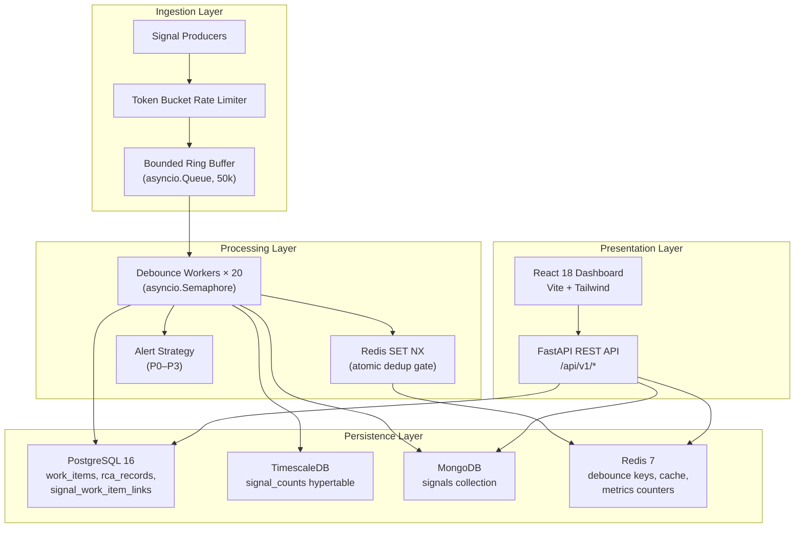
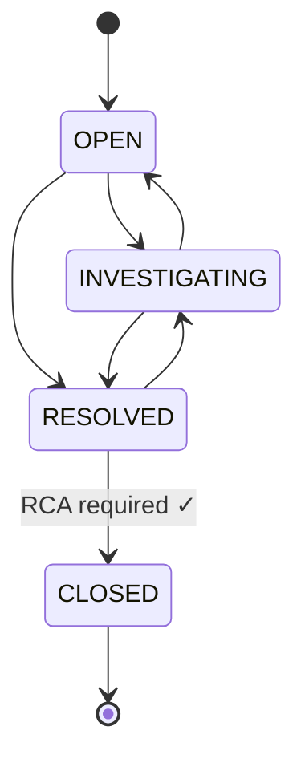

# Architecture

Detailed component descriptions for the Incident Management System.

---

## High-Level Overview

The system follows a **producer → buffer → worker → store** pipeline architecture with a React-based dashboard consuming the data via REST API.

---

## Component Details

### 1. Signal Ingestion (`api/routes/signals.py`)

The entry point for all infrastructure monitoring signals.

- **Rate limiting:** A token-bucket algorithm (`core/rate_limiter.py`) protects the endpoint. Configured for 1,000 req/s sustained with burst to 2,000. Implemented as a FastAPI dependency — `Depends(RateLimitDep)`.
- **Buffering:** Accepted signals are pushed onto a bounded `asyncio.Queue` (50,000 capacity) via `put_nowait()`. If the queue is full, the endpoint returns HTTP 429 with a `Retry-After` header.
- **Non-blocking:** The endpoint returns HTTP 202 immediately. Persistence is fully decoupled.

### 2. Debounce Engine (`core/debounce.py`)

Twenty async worker tasks drain the signal buffer in parallel, throttled by an `asyncio.Semaphore(20)`.

**Deduplication flow per signal:**

1. Attempt `SET debounce:{component_id} "" NX EX 10` in Redis.
2. **Key was set** (first signal in the 10-second window):
   - Create a new `OPEN` work item in PostgreSQL (transaction).
   - Write the work item UUID back to the Redis key.
   - Insert raw signal into MongoDB.
   - Insert link row into `signal_work_item_links`.
   - Insert counter row into TimescaleDB `signal_counts`.
   - Fire the alert strategy.
3. **Key already existed** (duplicate within window):
   - Read the existing work item ID from Redis.
   - Insert raw signal into MongoDB.
   - Insert link row.
   - Increment signal counter.

**Race condition handling:** The `SET NX` command is atomic — only one coroutine per component can "win." A brief retry loop handles the tiny race where the winner hasn't written the work item ID yet.

### 3. Alert Strategy (`patterns/alert_strategy.py`)

Implements the **Strategy** design pattern.

| Component Type | Strategy | Behaviour |
|---------------|----------|-----------|
| `rdbms` | `P0Strategy` | CRITICAL log, PagerDuty-style critical channel |
| `api` | `P1Strategy` | ERROR log, high-priority Slack channel |
| `cache` | `P2Strategy` | WARNING log |
| `queue`, `nosql` | `P3Strategy` | INFO log |

A factory function `get_alert_strategy(component_type)` maps component types to strategies. Unknown types default to P3.

### 4. Work Item FSM (`patterns/work_item_state.py`)

Implements the **State** design pattern with four concrete states:

- **`ClosedState`** is terminal — all transitions raise `InvalidTransitionError`.
- **`ResolvedState → CLOSED`** is guarded — calls `rca_is_complete(work_item_id)` and raises `RCARequiredError` if the RCA is missing or has empty fields.
- Every valid transition is persisted in a PostgreSQL transaction immediately.

### 5. Database Layer (`db/`)

| Module | Driver | Purpose |
|--------|--------|---------|
| `postgres.py` | asyncpg | Connection pool (min=5, max=20), retryable write helpers |
| `mongo.py` | motor | Async MongoDB client, retryable insert/find helpers |
| `redis_client.py` | redis.asyncio | Cache reads, debounce keys, metrics counters |
| `retry.py` | — | Generic `async_retry` decorator with exponential backoff |

**Retry policy:** Only transient errors are retried (connection exhaustion, network timeouts). Constraint violations and auth failures are never retried.

### 6. REST API (`api/routes/`)

| Endpoint | Cache | Notes |
|----------|-------|-------|
| `GET /api/v1/incidents` | Redis (30s TTL) | Dashboard list, invalidated on status change |
| `GET /api/v1/incidents/{id}` | None | Joins PG work item + MongoDB signals |
| `PATCH /api/v1/incidents/{id}/status` | Invalidates cache | FSM transition, 409/422 on violations |
| `POST /api/v1/incidents/{id}/rca` | None | Validates non-empty fields, computes MTTR |
| `GET /health` | None | Parallel checks via `asyncio.gather` |

### 7. Frontend (`frontend/`)

- **React 18** with functional components and hooks.
- **Vite** dev server with HMR and API proxy to the backend.
- **Tailwind CSS** for utility-first styling.
- **Polling:** `IncidentFeed` polls `GET /api/v1/incidents` every 15 seconds.
- **Lifecycle stepper:** Four-step horizontal stepper with visual progress.
- **RCA form:** Client-side validation (20-char minimums) + server error display.

### 8. Throughput Metrics

A background `asyncio.Task` reads and resets a Redis counter (`metrics:signals_ingested`) every 5 seconds, computing and logging signals/sec. This provides real-time observability without external monitoring infrastructure.
