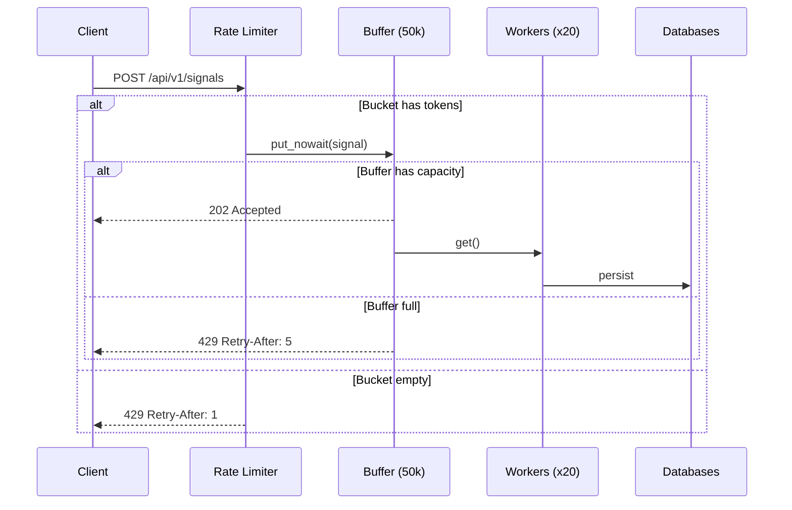

# Backpressure & Load Shedding

An in-depth explanation of how the Incident Management System handles overload without crashing.

---

## The Problem

During a real outage, signal volume spikes by orders of magnitude. A naïve approach (synchronous DB writes) leads to memory exhaustion, event loop starvation, and cascading failure.

---

## Two-Layer Defence

### Layer 1: Token-Bucket Rate Limiter (`core/rate_limiter.py`)

- **Rate:** 1,000 tokens/sec sustained, **Capacity:** 2,000 burst.
- Protected by `asyncio.Lock`, uses `time.monotonic()`.
- Returns HTTP 429 **before** the request reaches the buffer.

### Layer 2: Bounded Ring Buffer (`core/buffer.py`)

- `asyncio.Queue(maxsize=50_000)` with `put_nowait()`.
- Fails fast on `QueueFull` → HTTP 429 + `Retry-After: 5`.
- Never blocks the event loop or holds HTTP connections open.

## Consumer Side: Debounce Workers (`core/debounce.py`)

20 async workers drain the buffer, throttled by `asyncio.Semaphore(20)`. If DBs are slow, workers take longer, the buffer fills, and the endpoint starts returning 429 — **graceful degradation**.

## Why Not Kafka?

| Feature | asyncio.Queue | Kafka |
|---------|:---:|:---:|
| Bounded backpressure | ✅ | ✅ |
| Zero operational overhead | ✅ | ❌ |
| Cross-process durability | ❌ | ✅ |

Trade-off is acceptable: monitoring signals are ephemeral, agents resend on next poll, and swapping in Kafka is a single-layer change.

## Summary

| Failure Mode | Mitigation | Response |
|-------------|-----------|----------|
| Burst traffic | Token bucket drains | 429 + Retry-After: 1 |
| DB writes slow | Buffer fills to 50k | 429 + Retry-After: 5 |
| Transient DB error | Exponential backoff (3 attempts) | Transparent |
